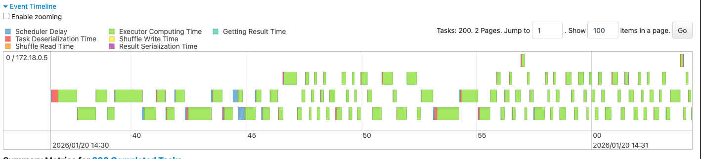
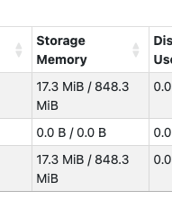
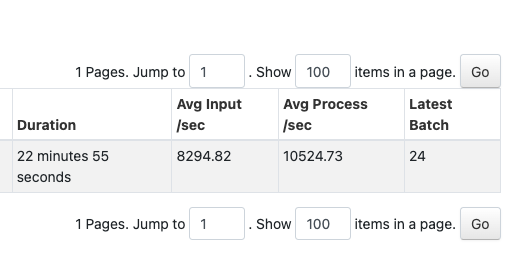
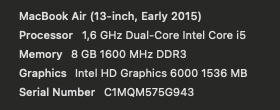
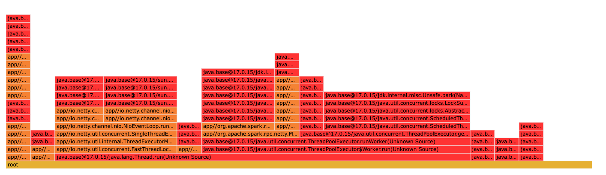
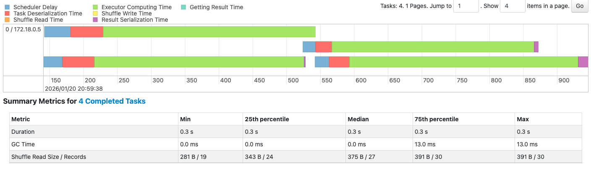

# Activity 1
### 1. The Bottleneck: Which Stage has the longest "Duration"? What are the technical reasons for it?
The stage that takes the longest in terms of time is the one with two tasks. However that makes sense since it does filtering. The real bottleneck is the stage with 200 tasks. It does not make any sense to split it into 200 since we only have one core. Spark assumes we have 200 cores (that is the default) but they all end up being ran one one core so splitting add unnecessary overhead.



### 2. Resource Usage: In the Executors tab, how much memory is currently being used versus the total capacity?
Right now after runnng for a long time it is using only 17.3 / 848.3 MiB


### 3. Explain with your own words the main concepts related to performance and scalability in the scenario of Spark Structured Streaming.
What is important to consider are how many cores, RAM and tasks we have. While one core can run many tasks (like in the current case) what would be better is to specify more cores so that they can run tasks in parallel. Those do then need to be merged which adds additional overhead so adding way too many cores and splitting stages in way too many tasks also does not work too well. There needs to be a ballance between those.

# Activity 2
``` bash
spark-submit \
  --master spark://spark-master:7077 \
  --packages org.apache.spark:spark-sql-kafka-0-10_2.13:4.0.0 \
  --num-executors 1 \
  --executor-cores 2 \
  --executor-memory 1G \
  --conf "spark.sql.shuffle.partitions=4" \
  /opt/spark-apps/spark_structured_streaming_logs_processing.py 
``` 


This is the best I got :)))))) \


For context this is what I am working with (🥔):\



The bottleneck is simply that the query is taking some time to process