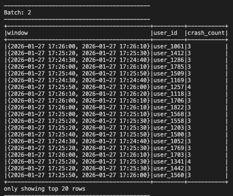
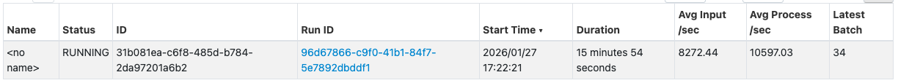
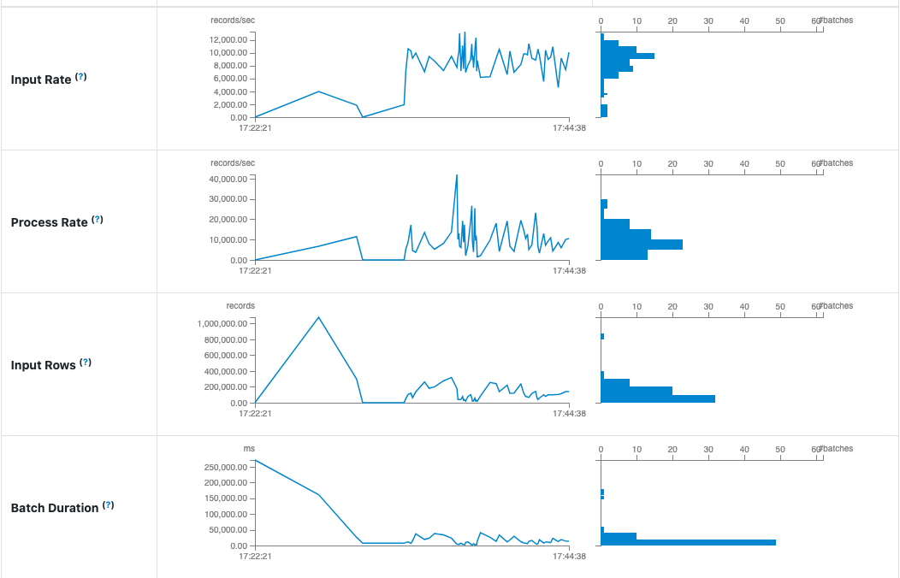
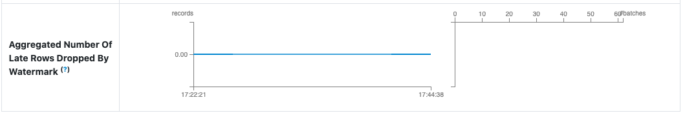

# Activity 1
### 1. The Bottleneck: Which Stage has the longest "Duration"? What are the technical reasons for it?
The stage that takes the longest in terms of time is the one with two tasks. However that makes sense since it does filtering. The real bottleneck is the stage with 200 tasks. It does not make any sense to split it into 200 since we only have one core. Spark assumes we have 200 cores (that is the default) but they all end up being ran one one core so splitting add unnecessary overhead.


### 2. Resource Usage: In the Executors tab, how much memory is currently being used versus the total capacity?
Right now after runnng for a long time it is using only 17.3 / 848.3 MiB


### 3. Explain with your own words the main concepts related to performance and scalability in the scenario of Spark Structured Streaming.
What is important to consider are how many cores, RAM and tasks we have. While one core can run many tasks (like in the current case) what would be better is to specify more cores so that they can run tasks in parallel. Those do then need to be merged which adds additional overhead so adding way too many cores and splitting stages in way too many tasks also does not work too well. There needs to be a ballance between those.

# Activity 2
```bash
docker exec -it kafka kafka-topics.sh \
  --bootstrap-server localhost:9092 \
  --create \
  --topic logs \
  --partitions 2 \
  --replication-factor 1
```

``` bash
spark-submit \
  --master spark://spark-master:7077 \
  --packages org.apache.spark:spark-sql-kafka-0-10_2.13:4.0.0 \
  --num-executors 1 \
  --executor-cores 2 \
  --executor-memory 1G \
  --conf "spark.sql.shuffle.partitions=2" \
  /opt/spark-apps/spark_structured_streaming_logs_processing.py 
``` 


This is the best I got :)))))) \


For context this is what I am working with (🥔):\


The bottleneck is simply that the query is taking some time to process

# Activity 3

``` bash
spark-submit \
  --master spark://spark-master:7077 \
  --packages org.apache.spark:spark-sql-kafka-0-10_2.13:4.0.0 \
  --num-executors 1 \
  --executor-cores 2 \
  --executor-memory 1G \
  --conf "spark.sql.shuffle.partitions=2" \
  /opt/spark-apps/Activity3.py 
``` 

### Implementation explanation:

The only part I changed was the processing part <br>

Adding the timestamp
``` python
events_df = (
    parsed_df
    .withColumn(
        "event_time",
        to_timestamp((col("timestamp") / 1000).cast("double"))
    )
)
```

Filtering for crashes when severity high or critical
``` python
filtered_df = (
    events_df
    .filter((lower(col("content")).contains("crash")) & 
            (col("severity").isin("High", "Critical")))
)
``` 

Setting the watermark to 30 seconds, window to 10 seconds, grouping by that and user_id, aggregating and showing only ones with more than 2 crashes
``` python
aggregated_df = (
    filtered_df
    .withWatermark("event_time", "30 seconds")
    .groupBy(
        window(col("event_time"), "10 seconds"),
        col("user_id")
    )
    .agg(count("*").alias("crash_count"))
    .filter(col("crash_count") > 2)
)
```

This is what I got


### Performance:




### Late record handling
The way we handle those here is with watermarks. A watermark of 30 seconds mean that we give records 30 more seconds to arrive late. If we have a window from 00 to 10 and currently the latest record that spark had seen is from 32 - watermark = 32 - 30 = 02. So now since 02 < 10 - if a late even from that window (so with timestamp within 00-10) it still accepts it into the window and counts it. Now if another event arrives from 48 - watermark = 48 - 30 = 18. 18 > 10 - now the window is closed and a late even from that window will get ignored and not included in the aggregation. 



This image shows that even if some records arrived late the 30 second watermark was enough to not exclude them. <br>


### Scalability
This is can already be esily done by spark + kafka since we can just add more partitions, cores and executors.

### Fault tolerance
This is handled by spark's checkpoints. They store streaming progress, kafka offsets, and aggregation state. If a worker crashes - spark restores state from checkpoint and recomputes failed tasks.
